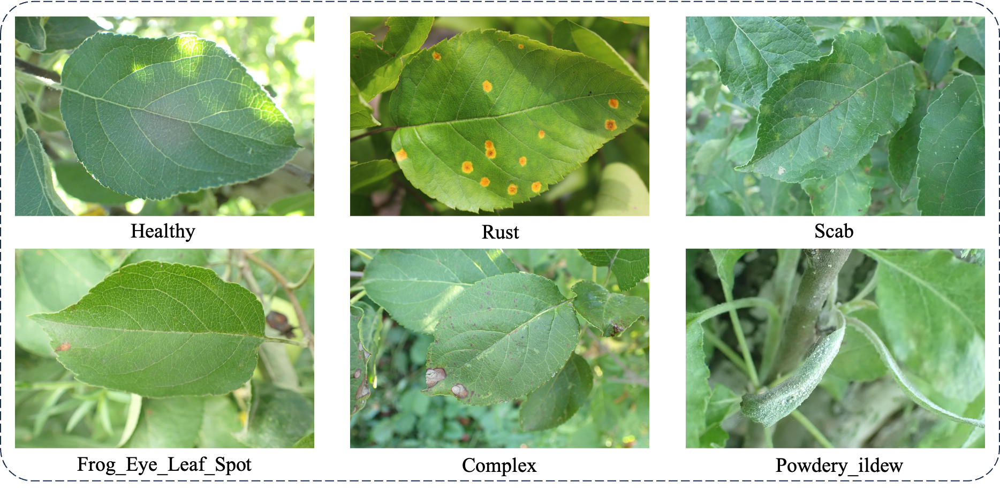
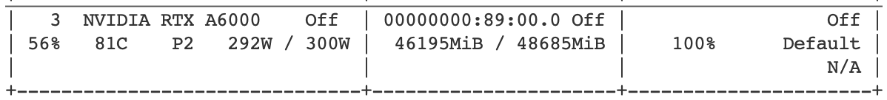
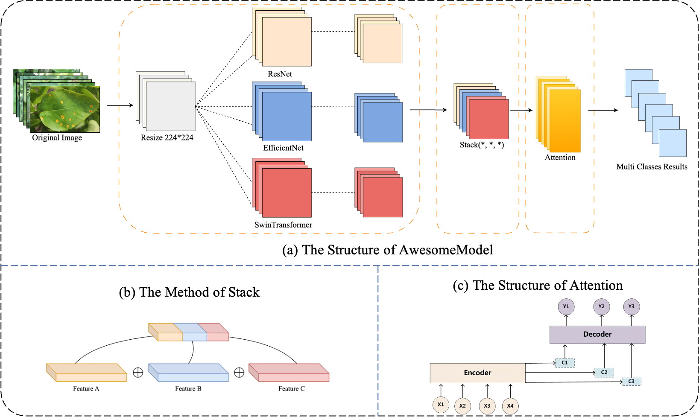
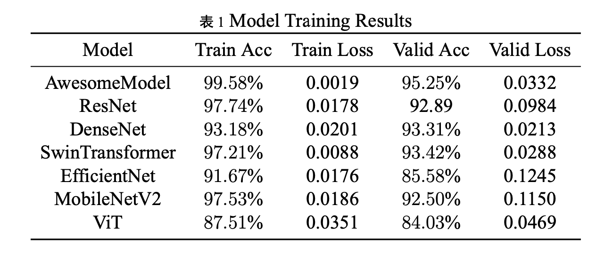
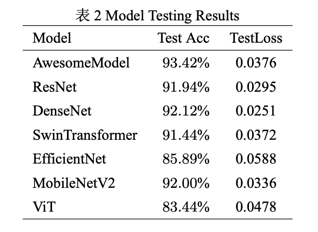
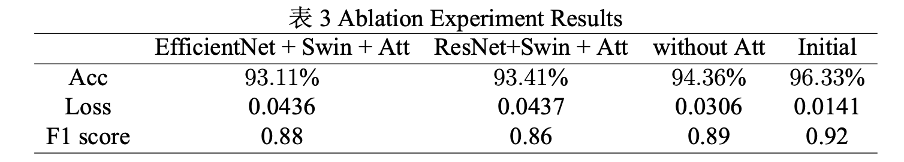
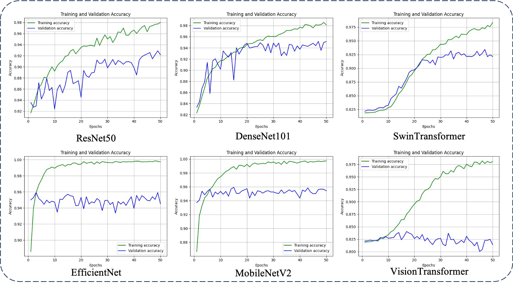

# Plant Pathology-2021分类任务的融合模型解决方案

## 项目说明

本项目是中山大学智能工程学院2023年秋本科生《计算机视觉》课程大作业。

任务与数据集链接：https://www.kaggle.com/competitions/plant-pathology-2021-fgvc8/overview



## 环境和设备

Pytorch 1.12.1

CUDA Version: 11.3

显卡：



## 模型框架



通过引入 Attention 模块和 Triplet Loss，结合 Model Fusion 策略，提出一种名为 AwesomeModel 的深度学习框 架，对苹果叶片疾病分类问题进行了深入研究。在与一系列深度学习模型对比中，AwesomeModel 在测试集上表现出卓越 的准确率 96.33% 和相对较低的损失值 0.0141，遥遥领先于其他模型。通过对 Attention 模块的可解释性讨论，我揭示了模 型对图像关键区域的关注程度。Triplet Loss 学习潜入空间更好地帮助模型对细粒度分类的理解。消融实验结果表明了模型 融合对性能提升的关键作用。

## 训练

模型代码：./models/AwesomeModel.py

训练代码：./train_2.py

### 命令行传参

```python
parser = argparse.ArgumentParser()
parser.add_argument('--device', default='3', help='cuda device, i.e. 0 or 0,1,2,3 or cpu')
parser.add_argument('--num_of_epoch', type = int, default=1, help='num of epoch')
parser.add_argument('--batch_size', type = int, default=8, help='batch size')
parser.add_argument('--lr', type = float, default=0.0001, help='learning rate')
parser.add_argument('--train_label_dir', default='/home/hbenke/Project/Lvwc/Project/cv/leaf_disease_classifier/dataset/train.csv', help='train label dir')
parser.add_argument('--train_image_dir', default='/home/hbenke/Project/Lvwc/Project/Data/leaf_disease/train/images/', help='train image dir')
parser.add_argument('--val_label_dir', default='/home/hbenke/Project/Lvwc/Project/cv/leaf_disease_classifier/dataset/val.csv', help='val label dir')
parser.add_argument('--val_image_dir', default='/home/hbenke/Project/Lvwc/Project/Data/leaf_disease/val/images/', help='val image dir')
parser.add_argument('--save_dir', default='/home/hbenke/Project/Lvwc/Project/cv/leaf_disease_classifier/runs/train_result/exp12/', help='save dir')
parser.add_argument('--weights_dir', default='', help='weights path')
args = parser.parse_args()
```

### 模型定义：

```python
leaf_model = AwesomeModel(num_classes = 6).to(device)
```

### 训练函数：

```python
def train_fn_triplet(net, loader, optimizer):
    tr_loss = 0
    correct_count = 0
    total_triplets = 0
    items = enumerate(loader)
    total_items = len(loader)

    for _, batch in tqdm(items, total=total_items, desc="train"):
        anchor_images, positive_images, negative_images = batch["anchor"].to(device), batch["positive"].to(device), batch["negative"].to(device)

        optimizer.zero_grad()

        anchor_embeddings = net(anchor_images)
        positive_embeddings = net(positive_images)
        negative_embeddings = net(negative_images)

        loss = triplet_loss(anchor_embeddings, positive_embeddings, negative_embeddings)
        loss.backward()
        optimizer.step()

        tr_loss += loss.item()

        # 计算三元组排序准确率
        distances_positive = F.pairwise_distance(anchor_embeddings, positive_embeddings)
        distances_negative = F.pairwise_distance(anchor_embeddings, negative_embeddings)
        correct_count += torch.sum(distances_positive < distances_negative).item()
        total_triplets += anchor_embeddings.size(0)

    accuracy = correct_count / total_triplets if total_triplets > 0 else 0
    return accuracy, tr_loss / TRAIN_SIZE
```

## 模型权重下载

[AwesomeModel的best weight](https://drive.google.com/file/d/1srK5_hd1-_BRrs7tfYJtoJ5-krvapswq/view?usp=share_link)

[AwesomeModel with TripletLoss的best weight](https://drive.google.com/file/d/1Osx6j6y2x_0VEjTxgYSSn0-Umgq4Lhcu/view?usp=share_link)

## 模型性能

### 训练



### 测试



### 消融实验



## 文件说明

### train_1.py

该文件训练对比模型、改进前的AwesomeModel

### train_2.py

该文件训练改进后基于Triplet Loss的AwesomeModel

### test_1.py

该文件测试对比模型、改进前的AwesomeModel

### test_2.py

该文件测试改进后基于Triplet Loss的AwesomeModel

### dataset

该文件夹存放数据预处理的脚本，使用了one-hot独热编码

### loss_function

#### TripletLoss（实现并用于提升细粒度分类性能）

#### AngularPenaltySMLoss（未实现）

#### ArcFaceLoss（未实现）

#### FocalLoss（未实现）

### models

存放模型文件

```
.
├── AwesomeModel.py
├── AwesomeModel2.py
├── AwesomeModel3.py
├── AwesomeModel4.py
├── DenseNet.py
├── EfficinetNet.py
├── MobileNetV2.py
├── ResNet50.py
├── SwinTransformer.py
├── VisionTransformer.py
├── __init__.py
└── __pycache__
```

AwesomeModel为主模型，234为消融实验，其余深度学习框架用于对比实验。

### runs

存放训练/测试结果。

### visualize

存放了可视化函数（ConfusionMatrixMake.py）

## 附录

对比模型训练过程：


